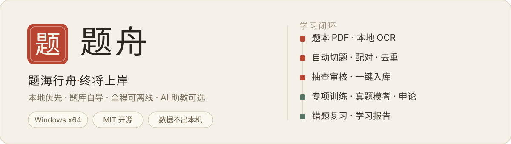

<p align="center">
  
</p>

<p align="center">
  <a href="https://github.com/nghqqa/tizhou/releases/latest"></a>
  <a href="LICENSE"></a>
  
  
</p>

**题舟** 是一个**本地优先**的开源考公学习工作台：学习数据存在你自己的电脑上，无广告、无推送、无遥测；题库由你自己导入，扫描版题本 PDF 也能一键转成结构化题库；AI 助教可选接入，不装模型也能完整刷题。

> 题海行舟，终将上岸。

---

## 它能解决什么

| 备考中的常见困扰            | 题舟的做法                                                                  |
| --------------------------- | --------------------------------------------------------------------------- |
| 刷题 App 广告多、数据在云端 | 完全本地运行，数据存本机 SQLite，随时备份迁移                               |
| 买的题本 PDF 躺着吃灰       | 题本 + 解析册同批导入：本地 OCR → 自动切题 → 按题号配答案 → 去重 → 抽查入库 |
| 真题只能纸质翻着做          | 161 套历年真题按原题号整卷组卷、限时模考、自动评分                          |
| 错题散落各处没人管          | 错题自动归类，错因记录 + 间隔复习，可追问 AI 讲解                           |
| 申论写完没人改              | 草稿自动保存不丢失，AI 评估 + 本地规则评分兜底                              |

## 功能总览

- **题库直导** — 题本/解析/答案册 PDF 一键导入，扫描件本地 OCR（逐页检测文字层，混合 PDF 不漏识别）；配对一致性自动校验，疑似套号错位整书拦截；切题结果先审核再发布，支持按任务撤销
  - 适用性提示 — 文字为主模块（言语 / 判断 / 片段阅读）导入效果最佳；资料分析等**图表密集型材料依赖图表数字还原，OCR 后务必逐项核对材料数字**（识别置信度高不等于数字层级关系正确），或配合「AI 变式训练」生成替代练习
- **行测训练** — 顺序 / 随机 / 自适应三种模式，即时或汇总解析，断点续练
- **真题原卷模考** — 选卷即考，限时作答，交卷后成绩单（得分 / 正确率 / 用时）；主观题自动保存，保存失败会阻止交卷并提供重试
- **错题复习** — 错因记录、分级间隔复习、AI 深度讲解
- **申论作答** — 给定材料 + 题干 + 草稿自动保存 + AI 评估
- **学习分析** — 今日工作台、学习报告、能力诊断、学习计划
- **数据安全** — 每日自动备份、跨机迁移包、旧版本数据目录自动迁移
- **自动更新** — 应用内检查更新，增量下载后一键安装

## 下载安装

### 系统要求

| 项目     | 要求                                                                                         |
| -------- | -------------------------------------------------------------------------------------------- |
| 操作系统 | Windows 10 1809+ / Windows 11（64 位）                                                       |
| 内存     | 4 GB（推荐 8 GB）                                                                            |
| 硬盘     | 500 MB（应用）+ 200 MB（OCR 引擎）+ 题库空间                                                 |
| Python   | 3.10+，仅"扫描 PDF 导入"需要；[python.org](https://www.python.org/) 安装时勾选 _Add to PATH_ |
| 网络     | 仅下载引擎、检查更新、使用 AI 功能时需要；日常刷题完全离线                                   |

### 安装步骤

1. 到 [GitHub Releases](https://github.com/nghqqa/tizhou/releases/latest) 下载 `tizhou-setup-X.X.X.exe`（可用同页 `SHA256SUMS.txt` 校验完整性）
2. 双击运行。Windows SmartScreen 提示"未知发布者"时，点击**更多信息 → 仍要运行**（应用未购买商业代码签名证书）
3. 安装完成即启动，**内置示例题库**可直接体验训练、模考、申论、报告全部功能

## 快速上手

```
3 分钟体验：装好应用 → 侧栏「专项练习」→ 开始答题
```

```
完整配置（约 10 分钟）：
1. 知识库工坊 → 安装转换引擎（约 200 MB，含 OCR 模型）
2. 知识库工坊 → 选择题本目录 → 直导题库 → 抽查 → 发布
3. 模型设置 → 选择服务商 → 填入 API Key → 测试连接（可选）
4. 开始刷题
```

📖 **[完整用户手册](docs/user-guide.md)** — 安装更新、各功能模块用法、数据备份迁移、隐私说明、常见问题

📚 **[题库导入指南](docs/question-bank-import.md)** — 三种导入渠道与题库格式说明

> 题舟不分发任何题目内容（版权原因）：内置的示例题库仅供体验功能，正式题库请使用你自己拥有的资料导入。

## 隐私承诺

- ❌ 不上传学习数据，不上传你导入的 PDF / Word 资料
- ❌ 不收集使用统计或诊断数据，无遥测
- ✅ API Key 使用 Windows DPAPI 加密存储，明文不落盘
- ✅ 仅在主动使用 AI 功能时调用你配置的模型服务；检查更新只访问 GitHub Releases 版本信息

## 开发者

<details>
<summary>技术栈 / 项目结构 / 命令</summary>

**技术栈**

| 层       | 技术                                                   |
| -------- | ------------------------------------------------------ |
| 桌面框架 | Electron 43（electron-vite 构建）                      |
| 界面     | React 19 + Fluent UI 9，宣纸白 / 墨黑双主题            |
| 数据     | SQLite（学习记录）+ Markdown（题库与知识文档）         |
| OCR      | RapidOCR（PP-OCR 同源 ONNX 模型，本地离线）+ pypdfium2 |
| 更新     | electron-updater + GitHub Releases                     |

**项目结构**

```
src/
├── main/              Electron 主进程：数据库、题库解析、OCR、AI、更新
├── renderer/          React 界面：训练、模考、知识中心、设置
├── shared/            类型契约、Prompt 协议、OCR 解析器
└── preload/           IPC 桥
tools/                 OCR worker（Python）、直导脚本、打包烟雾测试
tests/                 Vitest 测试（91 项，含真实 OCR 集成测试）
docs/                  用户手册、导入指南、UAT 清单、架构文档
```

**命令**

```bash
npm install
npm run dev            # 开发模式
npm test               # 运行 91 项测试
npm run typecheck      # 类型检查
npm run format:check   # 代码格式检查
npm run package        # 打包 Windows 安装包
npm run smoke:packaged # 打包后烟雾测试（输出到 dist-smoke/，不影响正式产物）
```

</details>

欢迎通过 [Issues](https://github.com/nghqqa/tizhou/issues) 反馈问题、[Pull Requests](https://github.com/nghqqa/tizhou/pulls) 贡献代码（先读 [CONTRIBUTING.md](CONTRIBUTING.md)）。发布前验证方式见 [UAT 清单](docs/uat-checklist.md)。

## 许可与致谢

[MIT](LICENSE)

- [RapidAI/RapidOCR](https://github.com/RapidAI/RapidOCR) — 本地 OCR 识别
- [Microsoft MarkItDown](https://github.com/microsoft/markitdown) — 文档格式转换
- [Electron](https://www.electronjs.org/) / [React](https://react.dev/) / [Fluent UI](https://github.com/microsoft/fluentui) — 应用框架与界面

---

<p align="center"><em>题海行舟，终将上岸。</em></p>
